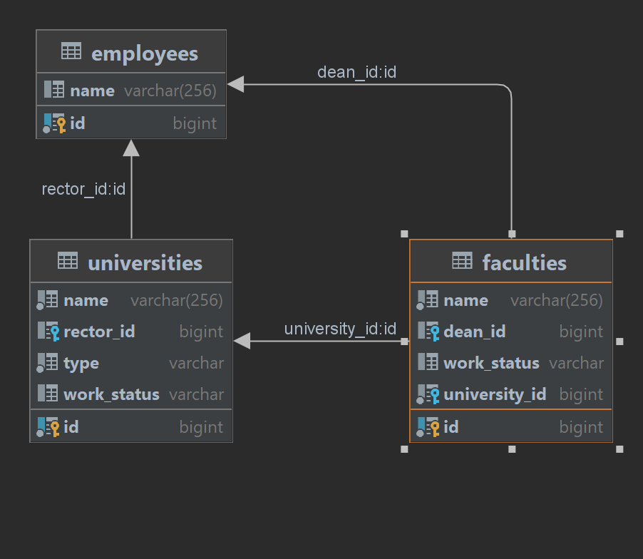

# testForDigitalChief

## Это репозиторий тестового задания для вакансии JAVA TRAINEE компании Digital Chief
#### Архитектура монолитная. Подключена БД (PostgreSQL) с помощью Hibernate ORM. Клиент-серверная структура на основе REST. Проект собран на Maven.

#### Проект включает в себя две сущности - Университет и Факультет. Сущности студентов, декана, ректора добавлены для проведения тестов, в эндпойнтах используются как заглушки. Пользователь может просматривать университеты и их факультеты. Модератор может добавлять, изменять и удалять университеты и факультеты. Работа сделана на основе функционала модератора - так как он более полный.
#### Для проверки и запуска добавлены Postman тесты. Временные затраты: 1 час архитектура. 9 часов - кодинг + тестирование и рефакторинг.

Факультет имеет следующие свойства:
	- id;
	- название;
	- декан;
	- статус работы;
	- список студентов;
	- принадлежность.
Университет имеет следующие свойства:
	- id;
	- название;
	- ректор;
	- статус работы;
	- список факультетов;
	- форма организации (гос. or комм.).
Сотрудник имеет следующие свойства:
	- id;
	- имя;
	- должность.

Поставленные задачи:
- [x] Продумать архитектуру
- [x] Создать БД 
- [x] Написать эндпойнты, согласно REST
- [x] Создать функционал DAL для университета
- [x] Создать функционал DAL для факультета
- [x] Создать сущности-заглушки
- [x] Создать методы для эндпойнтов, согласно REST
- [x] Написать Postman тесты

Приложение написано на Java при помощи Spring и сопутствующих библиотек. Пример кода:

```java
import org.springframework.boot.SpringApplication;
import org.springframework.boot.autoconfigure.SpringBootApplication;

@SpringBootApplication
public class UniversityAreaApplication {

	public static void main(String[] args) {
		SpringApplication.run(UniversityAreaApplication.class, args);
	}

}
```

#### ER-диаграмма базы данных для приложения:



#### Список эндпойнтов:

Модератор:
- UniversityAdminController:
	- получить список университетов
	``` GET "/universities" ```
	- получить университет по айди
	``` GET "/universities/{universityId}" ```
	- создать университет
	``` POST "/universities" ```
	- изменить университет по айди
	``` PATCH "/universities/{universityId}" ```
	- удалить университет по айди
	``` DELETE "/universities/{universityId}" ```
	- удалить все университеты
	``` DELETE "/universities" ```
- FacultyAdminController:
	- получить список факультетов
	``` GET "/universities/faculties" ```
	- получить факультет по айди
	``` GET "/universities/faculties/{facultyId}" ```
	- создать факультет
	``` POST "/universities/faculties" ```
	- изменить факультет по айди
	``` PATCH "/universities/faculties/{facultyId}" ```
	- удалить факультет по айди
	``` DELETE "/universities/faculties/{facultyId}" ```
	- удалить все факультеты
	``` DELETE "/universities/faculties" ```
- EmployeeAdminController:
	- создать пользователя
	``` POST "/users" ```

Пользователь:
- UniversityPublicController:
	- получить список университетов
	``` GET "/universities" ```
	- получить университет по айди
	``` GET "/universities/{universityId}" ```
- FacultyPublicController:
	- получить список факультетов
	``` GET "/universities/faculties" ```
	- получить факультет по айди
	``` GET "/universities/faculties/{facultyId}" ```